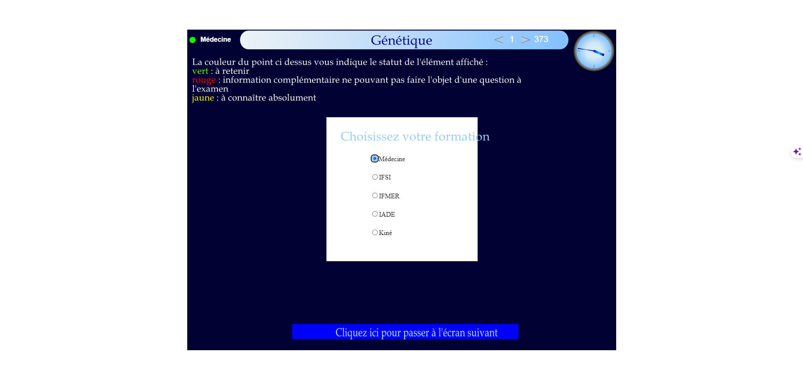

# export_adobe_animate_diapositive_to_pdf


## Description
This script is used to export to pdf all the diapositives contained in an Adobe Animate that was exported to HTML5 Canvas.

## Requirements
- nodejs

## Usage
- Clone this repository
- go to your diapositives folder
- run python -m http.server 8000
- go to the root of this repository
- run `npm install`
- create a .env file with the following content:
```
INPUT_FILE_PATH="PATH_TO_YOUR_HTML_FILE"
OUTPUT_FILE_PATH="PATH_TO_YOUR_PDF_FILE"
SLIDESHOW_URL="http://localhost:8000/genetique_exam2324.html"
CANVAS_SELECTOR=#canvas
SCREENSHOT_PATH="./output/images/"
```
- run `node screenshot-capture.js`
